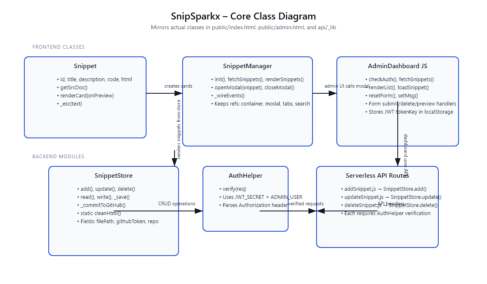
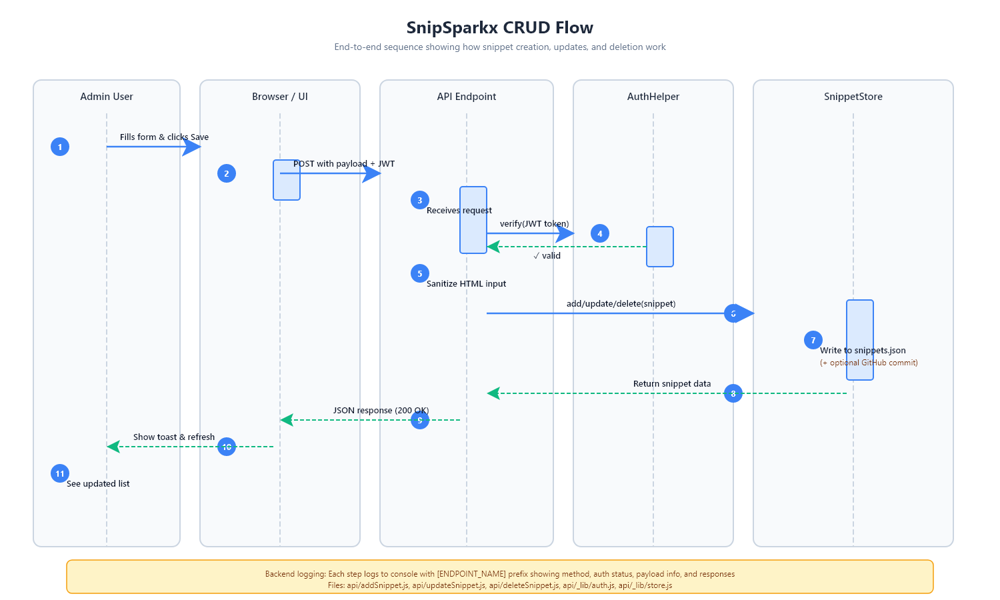

# SnipSparkx ⚡

**My CSS Snippet Collection Project**

This is a web app I built for my Object Oriented Programming course at Ziauddin University. It lets you save and preview CSS code snippets with live demos, plus has an admin panel for managing everything.


## 📖 What This Project Does
I wanted to build something that would help me (and other developers) quickly test CSS ideas and share them. Each snippet gets its own isolated preview so you can see exactly how it looks without any interference from other styles. 

For the OOP requirements, I used JavaScript classes throughout the frontend and backend. The serverless part was actually pretty cool to figure out - everything runs on Vercel without needing a traditional server.

### ✨ What It Can Do
- **Live Preview:** Every snippet shows up in a sandboxed iframe so you can see it working immediately
- **Admin Panel:** I built a login system with JWT tokens so only authorized users can add/edit snippets
- **Smart Saving:** 
  - When developing locally, it saves to JSON files
  - In production, it actually commits changes to GitHub automatically (I thought this was a neat idea)
- **Search:** You can filter through snippets as you type
- **Modern UI:** Used Tailwind CSS with that frosted glass effect that's popular now

## 🚀 Technologies I Used
- **Frontend:** Just HTML, CSS (Tailwind), and vanilla JavaScript with classes (no frameworks - wanted to keep it simple)
- **Backend:** Vercel's serverless functions seemed perfect for this since I don't need a full server running
- **Security Stuff:** Used bcrypt for password hashing (learned about this in class) and JWT tokens for login sessions
- **Extra Tools:** PostCSS for building the CSS, and Highlight.js to make the code look nice with syntax colors

## 🛠️ How to Run This Project

### What You'll Need
- Node.js (I used v18 but newer versions should work)
- Vercel account if you want to deploy it online (but you can run it locally too)

### 1. Get the code
```bash
git clone https://github.com/devfaisee/SnipSparkx.git
cd SnipSparkx
```

### 2. Install the packages
```bash
npm install
```

### 3. Set up your environment
You'll need to create a `.env` file with your settings (check `.env.example` for the template):
```env
# Admin Credentials
ADMIN_USER=admin
# Hash for 'admin123': $2a$10$sd23zeZlmqV1val6HiXKguw3C.l5opNbaj3w2jqV/QdQsMRuPvKsm
ADMIN_PASS_HASH=$2a$10$sd23zeZlmqV1val6HiXKguw3C.l5opNbaj3w2jqV/QdQsMRuPvKsm
JWT_SECRET=your_super_secret_key

# GitHub Storage (Optional)
GITHUB_TOKEN=your_github_pat
GITHUB_REPO=username/repo
GITHUB_BRANCH=main
```

### 4. Start it up
```bash
npm start
```
Then go to `http://localhost:3000` in your browser.

### 5. Using the admin panel
- Click "Open Admin Panel" or just go to `/admin.html`
- **Username:** `admin`
- **Password:** `admin123`

(Obviously you'd change these in a real deployment!)

## 📂 How I Organized Everything
```
├── api/                # Backend stuff (serverless functions)
│   ├── addSnippet.js   # Creates new snippets
│   └── admin/          # Login/auth handling
├── public/             # Frontend files
│   ├── index.html      # Main page with all the snippet cards
│   ├── admin.html      # Admin dashboard for managing snippets
│   └── snippets.json   # Where all the data gets stored
├── src/                # CSS source
│   └── input.css       # Tailwind setup
└── package.json        # All the npm dependencies
```

## 🛡️ Security Stuff I Implemented
I had to think about security since users can submit HTML/CSS:
1. **Iframe Sandboxing:** All user content runs in sandboxed iframes so malicious code can't mess with the main site
2. **Input Cleaning:** I strip out `<script>` tags and event handlers both on the frontend and backend 
3. **Environment Variables:** Kept all passwords and tokens in `.env` files instead of hardcoding them (learned this the hard way!)

## 🎓 About This Project
Built this for my Object Oriented Programming course at Ziauddin University. Had a lot of fun figuring out how to make everything work together!

Special thanks to my classmates who helped test it and gave feedback on the UI.

## 🧱 System Design Overview

### Class Diagram


*Pulled straight from the actual code (Snippet, SnippetManager, Admin dashboard JS, SnippetStore, Auth helper, and the serverless API files).*

### CRUD Sequence (End-to-End)


*Shows the exact flow from admin form submission → browser fetch → Vercel API → Auth helper → SnippetStore, plus the response back to the UI.*

### How Everything Flows
1. **When Someone Visits**
   - The `SnippetManager` class loads up all snippets from the JSON file and creates `Snippet` objects
   - Each snippet gets rendered as a card with a live preview iframe
   - Clicking opens a modal where you can see the code and copy it
2. **Admin Workflow**
   - Admin page checks for a login token in browser storage
   - After logging in (with bcrypt password checking), you can create/edit/delete snippets
   - There's also a preview button to test stuff before saving
3. **Backend Processing**
   - All the API endpoints use the same `SnippetStore` class for data handling
   - Authentication happens through the `auth.js` helper I wrote
   - Data gets saved locally and can optionally sync to GitHub (which I thought was pretty clever)
4. **Live Updates**
   - Since everything reads from the same JSON file, changes show up immediately
   - No need to rebuild or restart anything during demos

